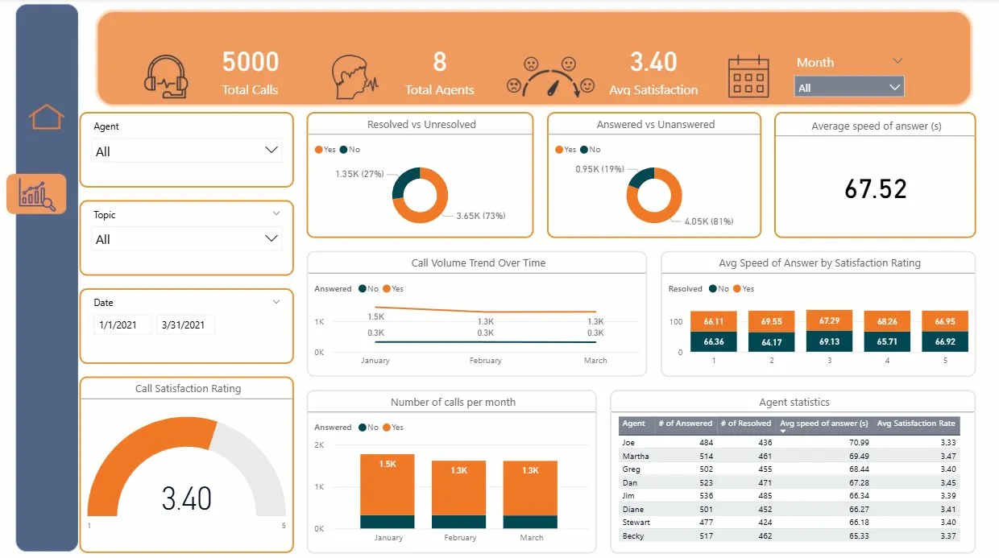

# 📊 Call Center Performance Dashboard — Power BI Business Intelligence Project


---

## 🗂️ Table of Contents

- [Executive Summary](#executive-summary)
- [Business Problem](#business-problem)
- [Project Overview](#project-overview)
- [Objectives](#objectives)
- [Dataset Description](#dataset-description)
- [Tools & Technologies](#tools--technologies)
- [Data Cleaning & Preparation](#data-cleaning--preparation)
- [Dashboard Development Process](#dashboard-development-process)
- [Key KPIs and Metrics](#key-kpis-and-metrics)
- [Dashboard Features](#dashboard-features)
- [Analysis & Insights](#analysis--insights)
- [Agent Performance Findings](#agent-performance-findings)
- [Customer Satisfaction Findings](#customer-satisfaction-findings)
- [Operational Challenges Identified](#operational-challenges-identified)
- [Business Recommendations](#business-recommendations)
- [Business Impact](#business-impact)
- [Dashboard Preview](#dashboard-preview)
- [Project Structure](#project-structure)
- [How to Use the Dashboard](#how-to-use-the-dashboard)
- [Skills Demonstrated](#skills-demonstrated)
- [Future Improvements](#future-improvements)
- [Conclusion](#conclusion)
- [Author](#author)

---

## Executive Summary

This project delivers a fully interactive Power BI dashboard and accompanying business intelligence report analyzing the operational performance of a call center during Q1 2021 (January–March). Drawing on data from 5,000 calls handled by 8 agents across five topic categories, the analysis surfaces critical performance gaps, benchmarks agent output, and provides data-driven recommendations to improve resolution rates, customer satisfaction, and staffing efficiency.

The center achieved a solid 81% answer rate but fell short on resolution quality, with 27% of calls leaving customers without a solution. With an average satisfaction score of 3.40 out of 5, the center is performing at an adequate but not competitive level. This project translates those raw numbers into a clear operational improvement roadmap for Q2 2021 and beyond.

---

## Business Problem

Call centers are high-cost, high-impact customer touchpoints. When calls go unanswered or customers leave without resolution, the business faces compounding costs — repeat contacts, churn risk, and reputational damage. Leadership needed clarity on three core questions:

1. Are we answering and resolving calls at an acceptable rate?
2. Which agents are driving strong outcomes, and which need support?
3. Does speed of answer actually influence how satisfied customers feel?

Without a centralized, interactive dashboard, these questions were difficult to answer consistently. This project was built to close that visibility gap.

---

## Project Overview

| Detail | Information |
|---|---|
| **Industry** | Customer Service / Call Center Operations |
| **Analysis Period** | Q1 2021 (January 1 – March 31, 2021) |
| **Total Calls Analyzed** | 5,000 |
| **Total Agents** | 8 |
| **Tool Used** | Microsoft Power BI Desktop |
| **Report Type** | Business Intelligence Dashboard + Analytical Report |
| **Primary Goal** | Identify performance gaps and drive operational improvement |

---

## Objectives

- Measure and visualize overall call answer and resolution rates across Q1 2021
- Analyze monthly call volume trends and identify capacity concerns
- Benchmark individual agent performance across key metrics
- Assess the relationship between speed of answer and customer satisfaction
- Identify systemic operational issues and deliver actionable recommendations

---

## Dataset Description

The dataset covers all inbound call center activity for Q1 2021 and includes the following fields:

| Field | Description |
|---|---|
| `Call ID` | Unique identifier for each inbound call |
| `Agent` | Name of the handling agent (8 agents total) |
| `Date` | Date of the call (January 1 – March 31, 2021) |
| `Topic` | Call category / topic classification (5 categories) |
| `Answered` | Whether the call was answered (Yes/No) |
| `Resolved` | Whether the call issue was resolved (Yes/No) |
| `Speed of Answer (s)` | Time in seconds before the call was answered |
| `Avg Talk Duration` | Average call handling duration |
| `Satisfaction Rating` | Customer-provided post-call rating (scale: 1–5) |

**Data scope:** 5,000 total calls — 4,054 answered (81%), 946 unanswered (19%), 3,646 resolved (73%), 1,354 unresolved (27%).

---

## Tools & Technologies

### Tech Stack

| Layer | Tool / Technology |
|---|---|
| **Visualization & Dashboard** | Microsoft Power BI Desktop |
| **Data Modeling** | Power BI Data Model (DAX) |
| **Data Transformation** | Power Query (M Language) |
| **Calculated Metrics** | DAX Measures & Calculated Columns |
| **Reporting** | Power BI Report View |
| **Documentation** | Markdown / PDF Report |

---

## Data Cleaning & Preparation

Before building the dashboard, the following preparation steps were completed in Power Query:

- **Null handling:** Identified and flagged null values in `Satisfaction Rating` and `Speed of Answer` fields to prevent skewed averages
- **Data type validation:** Ensured date fields parsed correctly for time-intelligence calculations; confirmed numeric fields for speed and rating columns
- **Categorical normalization:** Standardized Yes/No fields for `Answered` and `Resolved` to ensure consistent DAX filtering behavior
- **Date table creation:** Built a dedicated date dimension table to support month-level slicing and trend analysis
- **Agent name consistency:** Verified agent name fields were clean and matched across all records for accurate individual performance grouping

---

## Dashboard Development Process

The dashboard was developed in iterative stages:

1. **Requirements definition** — Identified the core KPIs relevant to call center leadership: answer rate, resolution rate, satisfaction, speed, and agent performance
2. **Data modeling** — Established relationships between the call records fact table and a supporting date dimension; defined DAX measures for all key metrics
3. **Visual selection** — Chose chart types aligned with the storytelling goal: donut charts for proportion (answered/resolved), bar charts for volume trends, and a gauge for satisfaction rating
4. **Filter architecture** — Implemented slicers for Agent, Topic, Month, and Date range to enable self-service exploration by operations managers
5. **Design** — Applied a consistent orange-and-dark color scheme aligned with the operational urgency theme; laid out the dashboard for top-to-bottom analytical flow
6. **Validation** — Cross-checked all visual totals against raw data aggregates to confirm accuracy before publishing

---

## Key KPIs and Metrics

| KPI | Value | Status |
|---|---|---|
| Total Calls | 5,000 | — |
| Answer Rate | 81% (4,054 calls) | ✅ Strong |
| Unanswered Rate | 19% (946 calls) | ⚠️ Watch |
| Resolution Rate | 73% (3,646 calls) | ⚠️ Needs Improvement |
| Unresolved Rate | 27% (1,354 calls) | 🔴 Concern |
| Avg Satisfaction Score | 3.40 / 5.00 | ⚠️ Moderate |
| Avg Speed of Answer | 67.52 seconds | ⚠️ Monitor |
| Total Agents | 8 | — |

---

## Dashboard Features

The dashboard provides the following interactive capabilities:

- **Global filters** — Slice all visuals simultaneously by Agent, Topic, Month, and date range
- **KPI header cards** — Instant visibility into Total Calls, Total Agents, and Average Satisfaction at the top of every view
- **Resolved vs Unresolved donut chart** — Proportional split of resolution outcomes with call counts and percentages
- **Answered vs Unanswered donut chart** — Answer rate visualization with absolute volumes
- **Average Speed of Answer display** — Large-format single metric card for at-a-glance operations monitoring
- **Call Volume Trend chart** — Month-over-month bar chart showing answered and unanswered call volumes (January–March)
- **Call Satisfaction Rating gauge** — Visual gauge rendering the 3.40 average on a 1–5 scale
- **Avg Speed of Answer by Satisfaction Rating** — Clustered bar chart correlating wait time with customer rating, segmented by resolution status
- **Agent Statistics table** — Per-agent breakdown of calls answered, calls resolved, average speed of answer, and average satisfaction rating

---

## Analysis & Insights

### Call Volume

Call volume declined moderately across Q1 2021, from 1,772 calls in January to 1,612 in March. This 9% reduction may reflect seasonal demand normalization after a high-activity period at the start of the year. However, unanswered calls held flat at approximately 300 per month throughout the quarter — a clear indicator that the capacity gap was structural, not seasonal.

### Resolution Gap

The most operationally significant finding is the 8.16-point gap between answer rate (81%) and resolution rate (73%). This means a meaningful share of customers who were successfully connected to an agent still left without their issue being resolved — a failure mode that drives repeat calls, increases operational cost, and erodes trust.

### Speed vs Satisfaction

Analysis of average speed of answer across all five satisfaction rating categories (1–5) reveals no consistent directional relationship. Customers who waited longer did not rate their experience significantly lower, and fast-answering calls did not produce noticeably higher ratings. This indicates that call resolution quality — not wait time — is the primary driver of customer satisfaction. Staffing decisions and training investments should prioritize resolution capability over speed optimization.

---

## Agent Performance Findings

| Agent | Calls Answered | Calls Resolved | Avg Speed (s) | Avg Satisfaction |
|---|---|---|---|---|
| Jim | 536 | 485 | 66.34 | 3.39 |
| Dan | 523 | 471 | 67.28 | 3.45 |
| Becky | 517 | 462 | 65.33 | 3.37 |
| Martha | 514 | 461 | 69.49 | **3.47** |
| Greg | 502 | 455 | 68.44 | 3.40 |
| Diane | 501 | 452 | 66.27 | 3.41 |
| Joe | 484 | 436 | **70.99** | 3.33 |
| Stewart | **477** | **424** | 66.18 | 3.40 |

**Key findings:**

- **Jim** led the team in both calls answered (536) and calls resolved (485), making him the highest-volume performer and a strong candidate for peer benchmarking
- **Martha** achieved the highest customer satisfaction rating (3.47), despite not being the fastest to answer — reinforcing the quality-over-speed finding
- **Becky** had the fastest average answer speed (65.33s), though this did not translate into the highest satisfaction score
- **Joe** recorded both the slowest answer speed (70.99s) and the lowest satisfaction score (3.33), suggesting a compounding performance challenge that warrants coaching attention
- **Stewart** handled the fewest calls in the quarter (477 answered, 424 resolved), which may indicate availability or scheduling concerns that should be reviewed against attendance records

The performance range across the team is narrow — satisfaction scores fall between 3.33 and 3.47 — indicating a consistently average team rather than a high-variance one. This is a coaching opportunity: relatively small improvements in resolution technique and communication quality across all agents could meaningfully shift the team average.

---

## Customer Satisfaction Findings

The overall average satisfaction score of **3.40 out of 5** places the center in the "adequate but unremarkable" range. No agent scored above 3.47, and none dropped below 3.33 — the team is performing within a narrow band that reflects consistent training but limited excellence.

Key observations:

- Satisfaction scores do not meaningfully improve when calls are answered faster, confirming that resolution quality is the central satisfaction driver
- Resolved calls did not consistently produce higher speed-of-answer times than unresolved ones, ruling out a simple speed explanation for unresolved outcomes
- To shift the satisfaction needle toward 4.0+, the center would need to focus on first-call resolution strategies, agent communication coaching, and post-call follow-up capability

---

## Operational Challenges Identified

| Challenge | Evidence | Severity |
|---|---|---|
| High unresolved call rate | 27% of all calls unresolved across Q1 | 🔴 High |
| Persistent unanswered calls | ~300 unanswered calls every month — no improvement | 🔴 High |
| Moderate satisfaction score | 3.40/5 — no agent exceeds 3.47 | ⚠️ Medium |
| Underperforming agents (Joe, Stewart) | Lowest satisfaction + fewest calls handled | ⚠️ Medium |
| No speed-satisfaction leverage | Speed improvements alone won't drive satisfaction gains | ℹ️ Informational |

---

## Business Recommendations

### 1. Improve First-Call Resolution
Invest in agent knowledge base tooling, structured escalation protocols, and call quality review processes. The 27% unresolved rate represents 1,350 customers per quarter who are likely to call back, increasing operational cost and reducing satisfaction. Target a resolution rate of **85% or above** by end of Q2 2021.

### 2. Address Peak-Hour Staffing
The consistent 300 monthly unanswered calls across all three months indicates a structural capacity gap during peak periods. Conduct hour-by-hour call volume analysis to identify the peak windows and schedule additional agent coverage accordingly. This is not a seasonal problem — it requires a scheduling solution.

### 3. Targeted Coaching for Joe and Stewart
Joe recorded the slowest average answer speed and the lowest satisfaction score on the team. Stewart handled the fewest calls in the quarter. Both would benefit from individualized performance reviews, call shadowing sessions, and structured coaching plans with clear 30-day targets.

### 4. Recognize and Replicate Top Performers
Martha's satisfaction rating (3.47) and Jim's resolution volume (485 resolved) should be treated as internal benchmarks. Facilitate structured peer learning sessions — call reviews, technique walkthroughs, or informal mentoring — to disseminate their approaches across the wider team.

### 5. Set a Q2 Satisfaction Target of 4.0
Introduce a formal satisfaction improvement target for Q2 2021. Complement the existing numerical rating with short post-call surveys to gather qualitative insight on what customers found helpful or frustrating. Quantitative scores tell you where the problem is; qualitative data tells you why.

---

## Business Impact

Delivering this analytics solution enables the call center operations team to:

- **Reduce operational cost** by cutting repeat contacts driven by unresolved first calls — targeting a 14-point improvement in resolution rate (73% → 85%) could reduce rework call volume by thousands per quarter
- **Improve customer retention** by moving the satisfaction average from 3.40 toward 4.0, reducing churn risk associated with poor service experiences
- **Allocate coaching resources effectively** by using the agent performance table to prioritize development spend on the agents with the greatest improvement potential
- **Optimize staffing schedules** by identifying peak-hour capacity gaps rather than adding headcount uniformly, reducing labor cost while improving service coverage
- **Establish a repeatable analytics process** — the dashboard framework can be refreshed with Q2 data to track improvement against Q1 baselines

---

## Dashboard Preview

### Dashboard Overview


---

## Project Structure

```
call-center-performance-dashboard/
│
├── 📁 data/
│   └── call_center_q1_2021.xlsx          # Source dataset
│
├── 📁 dashboard/
│   └── Call_Center_Dashboard.pbix        # Power BI Desktop file
│
├── 📁 report/
│   └── Call_Center_Performance_Report.pdf  # Business analysis report
│
└── README.md                             # This file
```

---

## How to Use the Dashboard

1. **Prerequisites:** Install [Microsoft Power BI Desktop](https://powerbi.microsoft.com/desktop/) (free download)
2. **Clone or download** this repository to your local machine
3. **Open** `dashboard/Call_Center_Dashboard.pbix` in Power BI Desktop
4. **Explore the dashboard** using the filter pane on the left:
   - Filter by **Agent** to isolate individual performance
   - Filter by **Topic** to assess category-specific resolution rates
   - Filter by **Month** to compare January, February, and March
   - Adjust the **Date** range slider for custom time windows
5. **Cross-filter visuals** by clicking on any chart element — all other visuals update in response
6. **Export insights** using Power BI's built-in export to PDF or PowerPoint for sharing with stakeholders

---

## Skills Demonstrated

| Category | Skills Applied |
|---|---|
| **Data Preparation** | Power Query, data cleaning, null handling, data type management |
| **Data Modeling** | Star schema design, date dimension tables, DAX calculated measures |
| **Dashboard Design** | KPI card design, visual hierarchy, filter architecture, UX layout |
| **Business Analysis** | KPI definition, gap analysis, operational benchmarking, root cause framing |
| **Data Storytelling** | Translating metrics into business narratives and actionable recommendations |
| **BI Development** | Power BI Desktop, DAX, Power Query (M), report publishing |
| **Communication** | Executive summary writing, stakeholder-ready reporting, documentation |

---

## Future Improvements

The following enhancements would extend the analytical depth of this project:

- **Hour-level call volume analysis** — Drill into intra-day patterns to pinpoint specific peak hours driving unanswered calls, enabling precise scheduling optimization
- **Topic-level resolution rates** — Identify which call categories have the highest unresolved rates and whether specific topics require specialist agent routing
- **Agent trend analysis over time** — Track individual agent satisfaction and resolution rates across rolling weeks to identify improvement or decline trajectories
- **Correlation modeling** — Apply statistical correlation between talk duration, speed of answer, and satisfaction to quantify the actual strength of these relationships
- **Predictive call volume forecasting** — Use historical Q1 trends to build a simple forecasting model for Q2 staffing planning
- **Power BI Service deployment** — Publish to Power BI Service for scheduled data refresh, role-level security by agent, and mobile-accessible views for managers

---

## Conclusion

This project demonstrates how structured business intelligence work can transform raw call center logs into a clear operational improvement roadmap. The Q1 2021 analysis confirms a center with solid foundational capability — high answer rates, a balanced agent team, and consistent process execution — but meaningful gaps in resolution quality and customer experience that are directly addressable with the right interventions.

The dashboard provides operations managers with the visibility they need to act on these gaps in real time: coaching the right agents, adjusting schedules to cover peak-hour demand, and setting measurable improvement targets for Q2. The analytical framework is designed to scale — refresh the data, and the insights update automatically.

---

## Author

**Happiness Onyemari**
Data Analyst | Business Intelligence Developer | Power BI Specialist

📧 Onyemarih93@gmail.com
🔗 [LinkedIn Profile](https://linkedin.com/in/onyemari-happy)
🐙 [GitHub Profile](https://github.com/onyemarihapp)

---

> *Built with Microsoft Power BI Desktop. Data covers Q1 2021 call center operations (January–March 2021). This project is intended for portfolio and educational demonstration purposes.*
